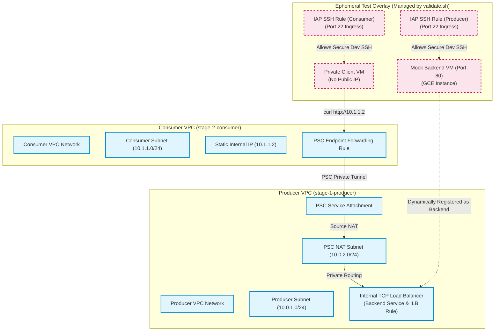

# Bare-Bones Private Service Connect (PSC) Reference Architecture

This repository contains a **100% clean, production-grade, barebones reference implementation** of Google Cloud **Private Service Connect (PSC) for Published Services**, packaged with an isolated, ephemeral end-to-end testing engine.

This blueprint is designed to be **completely reusable, production-ready, and free of testing bloat**, making it the perfect standard template for engineering teams publishing services securely across VPC boundaries (e.g., for Apigee hybrid ingress, GKE, databases, or third-party partner integrations).

---

## Clean Separation of Concerns (Architecture)

To maintain absolute architectural purity, this repository enforces a **strict physical segregation** between your reusable, production-ready infrastructure (HCL) and the temporary diagnostic resources used to test it (CLI/Shell).



### The Segregation Design:
1.  **Core Production Stages (`stage-1` & `stage-2`)**: These are **100% clean HCL**. They contain only the pure VPC networks, subnets, load balancing rules, and PSC endpoints. There are **no** mock VMs, **no** test clients, and **no** developer firewall rules mixed into these folders. They are production-ready and copy-pasteable.
2.  **Ephemeral Testing Overlay (`validation/`)**: The resources needed for sandbox data-plane testing (dummy client VM, mock python backend VM, and developer IAP SSH firewall rules) are **strictly isolated** from the Terraform configurations. They are spun up dynamically on-demand using `gcloud` CLI commands inside the validation script, and **automatically destroyed** the second the test finishes, leaving your GCP project pristine!

### The Purpose of the Two Paths (Production vs. Testing)
*   **For Production Deployments (Platform Architect)**:
    The core infrastructure operations team **only needs Stages 1 and 2, and Path A (Control-Plane Validation)**. This deploys the pristine network topology and verifies the tunnel is active without any VM or firewall overhead. In a real-world deployment, application teams will simply plug their *real* production client VMs and their *real* backend services (like Apigee runtime clusters or GKE ingresses) directly into these subnets, making the testing overlay completely unnecessary.
*   **For Code Maintainers / Testers of this Repo**:
    Path B (Data-Plane Validation) exists primarily for **code maintainers and testers of this repository**. It provides a 100% self-contained, automated, and **fully self-healing test suite** to verify that the underlying infrastructure code actually routes traffic correctly. Any developer modifying the HCL files can run Path B to prove that their changes did not break end-to-end routing, without needing to manually configure complex application stacks.
*   **Self-Healing Resilience**:
    Path B is **100% self-healing and idempotent**. Even if a test run fails, crashes, or is forcefully interrupted (e.g., by pressing `Ctrl+C` or encountering a network timeout), the script registers global exit traps and executes a **pre-flight sandbox cleanup** on the next run. This silently sweeps away any orphaned test VMs or developer firewall rules, guaranteeing a clean sandbox every time.

---

## Deployment & Validation Paths

You can deploy and validate this architecture in one of two ways.

### Path A: Control-Plane Validation (Without Test VMs)
This path deploys the pure production-ready routing shell and validates the PSC tunnel's health directly through GCP APIs, with **zero extra VMs, zero diagnostic firewall rules, and zero ongoing compute costs.**

#### Step 1: Deploy the Service Producer (Stage 1)
1.  Navigate to the producer directory:
    ```bash
    cd stage-1-producer
    ```
2.  Initialize and apply:
    ```bash
    terraform init
    terraform apply -var="project_id=YOUR_GCP_PROJECT_ID"
    ```
3.  Copy the `service_attachment_uri` output (looks like `projects/YOUR_PROJECT/regions/us-central1/serviceAttachments/psc-producer-service-attachment`).

#### Step 2: Deploy the Service Consumer (Stage 2)
1.  Navigate to the consumer directory:
    ```bash
    cd ../stage-2-consumer
    ```
2.  Initialize and apply, passing the Service Attachment URI:
    ```bash
    terraform init
    terraform apply \
      -var="project_id=YOUR_GCP_PROJECT_ID" \
      -var="service_attachment_uri=PASTE_YOUR_SERVICE_ATTACHMENT_URI_HERE"
    ```

#### Step 3: Validate the PSC Connection Status
Run the following `gcloud` command to check the status of the PSC connection on the Service Attachment:
```bash
gcloud compute service-attachments describe psc-producer-service-attachment \
    --region=us-central1 \
    --project=YOUR_GCP_PROJECT_ID \
    --format="value(connectedEndpoints[0].status)"
```
*   **Expected Output**: **`ACCEPTED`**
*   *Significance*: This confirms that the Private Service Connect tunnel is successfully established, bound, and active between the two VPCs at the Google network layer, with no compute VMs deployed!

---

### Path B: Data-Plane Validation (With Ephemeral Test VMs)
This path runs a complete end-to-end active packet validation by temporarily provisioning test VMs, curling the endpoint, and tearing them down automatically.

1.  **Execute the E2E Automator Script**:
    Run the orchestrator script from the root of the repository:
    ```bash
    ./validation/run_e2e_pipeline.sh
    ```
2.  **Watch the Ephemeral Validation Lifecycle**:
    *   The script deploys the pristine `stage-1` and `stage-2` networks.
    *   It calls `validate.sh`, which dynamically spins up a temporary backend VM running a Python HTTP server, attaches it to the Load Balancer, boots a temporary client VM, and creates temporary IAP SSH rules.
    *   It polls the load balancer health checks until the backend is **HEALTHY**.
    *   It tunnels through IAP to run `curl http://10.1.1.2` from the client VM, asserting a `200 OK` and verifying the JSON response.
    *   **On exit, the script automatically destroys all temporary VMs and firewall rules**, leaving only your clean production VPC networks.
3.  **Tear Down Core Infrastructure**:
    Respond `y` (yes) to the final prompt to destroy the core Stage 1 and Stage 2 networks.

---

## Clean Manual Cleanup
If you need to manually clean up your production stages, always destroy the Consumer first to release the network connection attachment:
```bash
# 1. Destroy Stage 2 (Consumer) First
cd stage-2-consumer
terraform destroy -var="project_id=YOUR_GCP_PROJECT_ID" -var="service_attachment_uri=YOUR_SERVICE_ATTACHMENT_URI"

# 2. Destroy Stage 1 (Producer) Second
cd ../stage-1-producer
terraform destroy -var="project_id=YOUR_GCP_PROJECT_ID"
```
